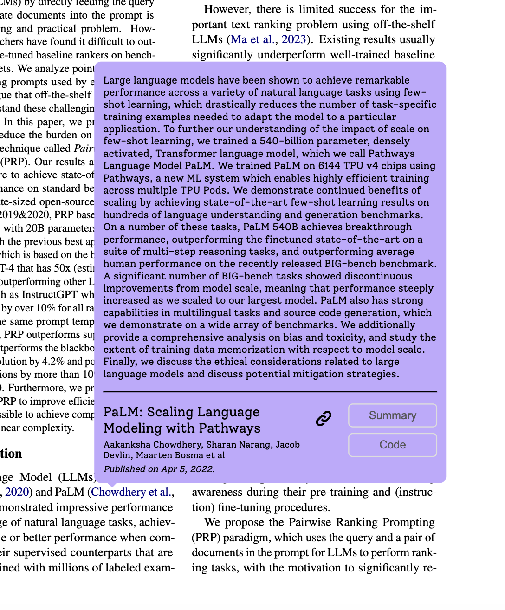

# Alice

### Alice is a Chrome Extension to supercharge your literature review, making research accessible to all.

## Problem

An average paper on arXiv **cites 30-50** other papers, that is 30-50 many concepts a reader may need to read through. Those new to research and those who read papers as a hobby face this barrier of entry, which could be demotivating and time-consuming. Currently, solutions include opening multiple tabs on your browser to have more context, but that is time-intensive and not optimal for your computing resources. With the advent of LLMs and AI tools, a lot of people use them to summarize key findings of a paper but that too requires one to navigate away from their paper and just makes the whole process inconvenient. 

## Solution

By integrating multiple APIs and aggregating data from multiple sources, Alice is your go-to tool for literature review and software development. 

Alice works by using pdf.js, which is a platform for rendering and interacting with PDFs on the web browser developed by Mozilla. Every time the user hovers on a citation linked in the PDF, Alice detects it and opens a popup with information about the cited paper so you don't have to navigate back-and-forth to the `References` section, copy the title, open arXiv again, for several hundred times. Alice uses the embedded link to get the title, year, and authors of the cited paper and uses the arXiv API to fetch relevant details to display (as seen in the image).

We go a step further. By integrating `Gemini-2.0-Flash`, a State-of-the-Art model known for very fast inference and scientific knowledge, Alice can summarize the cited paper on the click of a single button. No hassles of 23 open tabs in the background and a cluttered clipboard.

Research Papers also have a lot of code. There's a website dedicated to this, called [https://paperswithcode.com/](https://paperswithcode.com/) This website exists to democratize the implementation of these research papers as code that you can use in your software. Alice automates this for you as well! By using the arXiv API, we prompt-engineer the best model at coding: `Claude-3.7-Sonnet-Thinking` to thoroughly go through the cited paper and generate instructions for your code. It generates an embeddable link with all context necessary to replicate the paper's results. You can simply take the link, paste it into your favorite AI-code-editor and it will do the magic for you.

## Cost Optimizations

This tool is extremely cost-effective. It takes less than 5 cents to generate the code for a given paper, and completely free for summarization since it is currently on Gemini's Free Tier. There will also be no cost of servers or database, since it is a broswer extension. With just a few bucks of sponsorship, Alice can operate for years and serve thousands of users without ever charging them a penny. This tool takes less than 1 minute to install and is instantly available when you open a reserach paper.

## Inspiration

Today, hobbyists and newbies to the field of technology spend more time reading research papers than ever before. The rapid growth and widespread adoption of LLM technology have sparked greater public interest in the field on the academic level. As an undergraduate researcher and tech optimist, I too love reading research papers. They shape our present and will continue to guide us to the future. However, academia is not accessible to all because of its hefty prerequisites. 