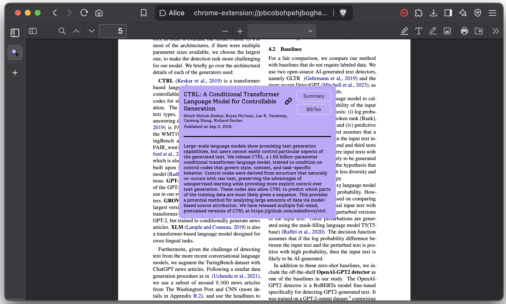
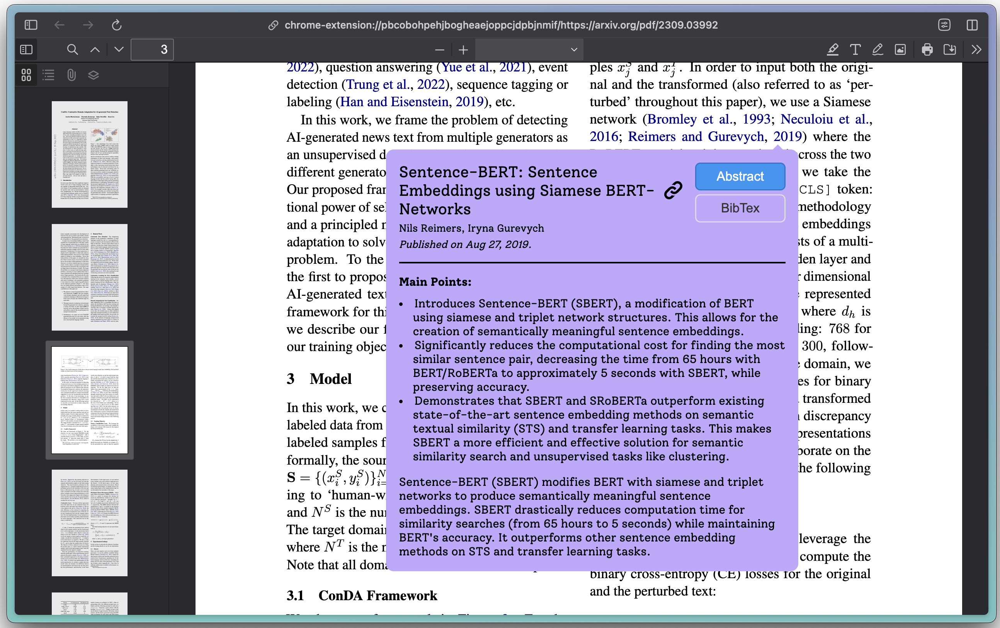

# Alice 🔍 - Browser Extension for Research Papers

  
  
   

Alice is a Web Extension to supercharge your literature review, making research accessible to all. Just hover on a citation and get all the information you need. Install now from [firefox add-ons](https://addons.mozilla.org/en-US/firefox/addon/alice-ai/) or the [chrome webstore](https://dub.sh/alice.pdf?utm_source=readme)!

## How Does It Work?

By integrating multiple APIs and aggregating data from multiple sources, Alice is your go-to tool for literature review and academic software development.

Alice works by using [pdf.js](https://github.com/mozilla/pdf.js), which is a `JavaScript` platform for rendering PDFs. Alice every hover, fetches information about the cited paper, and opens a popup with the information so you don't have to navigate back-and-forth to the References section several hundred times.

## Bring Your Own Key (Optional)

Alice works out of the box with no configuration required. However, if you're hitting rate limits, you can configure your own API keys for unlimited usage:

- **Google Gemini API Key** - For AI summaries. Get a free key at [https://aistudio.google.com/apikey](https://aistudio.google.com/apikey)
- **Semantic Scholar API Key** - Enables paper lookups. Get a free key at [https://www.semanticscholar.org/product/api#api-key](https://www.semanticscholar.org/product/api#api-key)

To configure, right-click the Alice extension icon → Options, or navigate to the extension settings in your browser.

## Inspiration

Hobbyists, mewbies, and researchers in the field of technology spend more time reading research papers than ever before. The rapid growth and widespread adoption of GenAI technology has sparked greater public interest in the field on an academic level. As an undergraduate researcher and tech optimist, I love reading research papers. They shape our present lives and will continue to guide us to the future. However, academia was not accessible to all readers because of its hefty prerequisites.

An average paper on arXiv **cites 30-50** other papers, that is 30-50 many concepts a reader may need to read through. Those new to research and those who read papers as a hobby face this barrier of entry, which could be demotivating and time-consuming. Currently, solutions include opening multiple tabs on your browser to have more context, but that is time-intensive and not optimal for your computing resources. With the advent of LLMs and AI tools, a lot of people use them to summarize key findings of a paper but that too requires one to navigate away from their paper and just makes the whole process inconvenient.

---

Built by [Aryan Keluskar](https://www.aryankeluskar.com/) :) Consider leaving a 🌟 if this adds value, and all feedback is very welcome. Feel free to message me [on twitter](https://x.com/soydotrun).
