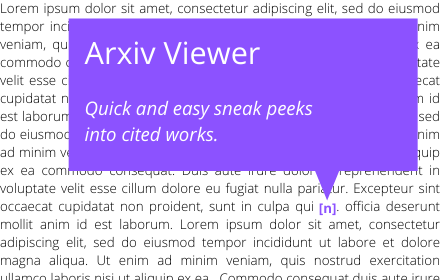

# Arxiv Viewer

Arxiv Viewer is a productivity chrome extension tool enabling quicker understanding of cited works on arXiv research papers. It's built using
the amazing open source web PDF viewer, [PDF.js](https://mozilla.github.io/pdf.js/).



## Installation

The best way to install is from the Chrome Web Store directly [here](https://chrome.google.com/webstore/detail/arxiv-viewer/cecdoioelofhklejiembhfjfhbilcgdo).

You can also install from source with the following commands. First clone this repository.
```
git clone https://github.com/tchittesh/arxiv-viewer.git
cd arxiv-viewer
```
Then, install Node.js via the official package or via nvm. Finally, install gulp, other dependencies, and build the chrome extension:
```
npm install -g gulp-cli
npm install
gulp chromium
```
Finally, open Chrome, go to More Tools > Extension and load the (unpackaged) extension from the directory `build/chromium`.


## How it Works

Every LaTeX+BibTeX compiled PDF document handles references to the cited works using internal hyperlinks. These point to a physical location in the pdf (page number, x, y coordinates), and they also contain a unique descriptor `d` of the cited work that is defined in the bibliography as something like
```
@article{d,
  ...
}
```
and referenced in the LaTeX source as `\cite{d}`. The current solution is to use this unique descriptor `d`, as it's by default of the form `[last name of first author][year published][first word of title]`. Once we extract these three fields, we make a call to arXiv's public API, and display a popup if we generate nonempty nonambiguous results. 


## Contributing/Future Work

Please let me know if you have any suggestions on how to improve the search process. Using Google Scholar would be optimal, as it contains a superset of arXiv papers and allows explicit searching by year; however, they do not have a public API. It would also be great to actually parse the bibliography at the physical location stored in the hyperlink; however, this seems nontrivial.
